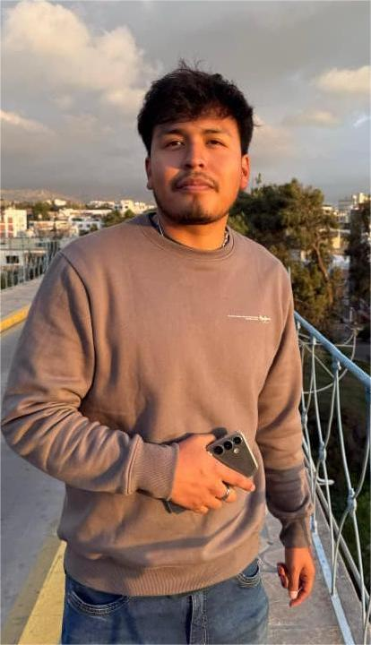

<!DOCTYPE html>
<html lang="es">
<head>
    <meta charset="UTF-8">
    <meta name="viewport" content="width=device-width, initial-scale=1.0">
    <title>Mi Página Personal</title>
    
</head>
<body>
    <h1>Luigui Andreé Calcina Batallanos</h1> 
    
    
<strong>Ejecutivo de Ventas</strong>

    
Arequipa - Perú

    
Email: <a href="mailto:calcinaluigui@gmail.com">calcinaluigui@gmail.com</a>

    

        <h2>Formación Académica</h2>
        <ul>
            <li><strong>Estudiante de Administracion de Negocios (Cursando) - </strong> <a href="https://ucsp.edu.pe/"> Universidad Catolica San Pablo </a></li>
            <li><strong>Egresado de la carrera de Gastronomia (2026) - </strong> <a href="https://www.isur.edu.pe/"> Instituto del Sur </a></li>
        </ul>
    

    

        <h2>Experiencia Profesional</h2>
        <ul>
            <li><strong>Ejecutivo de Ventas (Actualmente) - </strong><a href="https://tarjetaoh.pe/">Financiera Oh</a>   Me encargo de la venta de tarjetas de crédito y préstamos personales, brindando asesoría clara y confiable a los clientes. Gestiono todo el proceso de captación, evaluación y seguimiento, asegurando una experiencia rápida y eficiente.</li>
            <li><strong>Operario de Producción/Servicio y atencion al cliente (2025) - </strong><a href="https://www.popeyes.com.pe/">Popeyes Louisiana Kitchen Inc.</a>   Apoyé en la preparación eficiente de alimentos, el armado de pedidos y la atención directa al cliente. También aseguré el cumplimiento de estándares de calidad, limpieza y tiempos de entrega en un entorno de alta demanda.</li>
            <li><strong>Cocinero (2023 - 2024) - </strong><a href="https://www.instagram.com/patria209aqp/?hl=es">Patria 209</a>   Encargado de la preparación de platos, manteniendo altos estándares de sabor, presentación e higiene. Participé en el orden, mise en place y coordinación con el equipo para asegurar un servicio fluido.</li>
            <li><strong>Ayudante de Cocina (2022 - 2023) - </strong>  Restaurante Criollo Ccala   Brindé soporte en la preparación de insumos, mise en place y producción diaria. Colaboré con el equipo en mantener la limpieza, organización y buen ritmo de trabajo dentro de la cocina.</li>
        </ul>
    

    

        <h2>Certificaciones</h2>
        <ul>
            <li>Curso MS Excel Basico - Intermedio <a href="https://www.isur.edu.pe/extension-profesional/cronograma-cursos/">Extensión Profesional</a></li>
            <li>Programa de Liderasgo Integral Juvenil <a href="https://liderazgo.ucsp.edu.pe/">Programa de Liderazgo</a></li>
            <li>Curso de Cocina Criolla <a href="https://www.isur.edu.pe/extension-profesional/cronograma-cursos/">Extensión Profesional</a></li>
            <li>Curso de Pescados y Mariscos <a href="https://www.isur.edu.pe/extension-profesional/cronograma-cursos/">Extensión Profesional</a></li>
        </ul>
    

    

        <h2>Proyectos e Intereses</h2>
        <ul>
            <li>Empezar mis propios proyectos en el sector Gastronomico</li>
            <li>Especializarme en Emprendimiento</li>
            <li>Tener un emprendimiento gastronomico</li>
            <li>Inversiones y Negocios</li>
        </ul>
    

    

        <h2>Enlaces</h2>
        <ul>
           <li><a href="https://www.linkedin.com/in/luigui-calcina-53849b258?utm_source=share&utm_campaign=share_via&utm_content=profile&utm_medium=android_app">LinkedIn</a></li>
            <li><a href="https://www.instagram.com/luig_cc/?hl=es">Instagram profesional</a></li>
            <li><a href="https://www.instagram.com/guili_24/">Instagram personal</a></li>  
        </ul>
    

    

        <h2>Profesor y Compañeros de Curso</h2>
        <ul>
            <li><a href="https://socios.spc.org.pe/ecuadros/">Ernesto Cuadros-Vargas</a></li>
            <li><a href="https://erickquispeluna-boop.github.io/erickluna.github.io/">Erick Quipe Luna</a></li>
            <li><a href="https://chaskacandia.github.io/chaskacandiaochoa.github.io/">Chasca Candia Ochoa</a></li>
            <li><a href="https://roaldmacedo-boza.github.io/roaldmacedo.github.io">Macedo Boza Roald</a></li>
            <li><a href="https://pari-dot.github.io/Mauricio.github.io/">Mauricio Joel Pari Gomez</a></li>
            <li><a href="https://flaviamicaeladiazzevallos1.github.io/">Flavia Micaela Díaz Zevallos</a></li>
        </ul>
    

</body>
</html>
